# 🕸️ 知识图谱分析报告

**构建时间**: 2026/1/28 19:41:33
**知识库路径**: e:\K_Kiro_Work\knowledge-base

## 图谱统计

| 指标 | 数值 |
|------|------|
| 节点数 | 32 |
| 边数 | 149 |
| 平均度数 | 10.6 |

## 领域分布

| 领域 | 数量 | 占比 |
|------|------|------|
| solution | 18 | 56.3% |
| other | 10 | 31.3% |
| discussion | 2 | 6.3% |
| note | 2 | 6.3% |

## 🌟 核心节点 (高连接度)

| 标题 | 领域 | 连接数 |
|------|------|------|
| SETUNA ,能否解析这个程序 | solution | 17 |
| 创建 SETUNA 截图工具使用指南 | solution | 17 |
| Kiro Knowledge Base 插件开发 v2.0.... | solution | 16 |
| Kiro Knowledge Base 插件开发 | solution | 16 |
| Hook 自动执行 | solution | 16 |
| Create SETUNA screenshot tool ... | solution | 16 |
| LLM 认知编排系统架构分析 | solution | 16 |
| 探讨"神经网络式工作环境"架构思想 | solution | 16 |
| 更新 AI 专业术语通俗词典到 v2.0 | solution | 16 |
| 在这个文件夹搭建，我和你探讨解决问题的存储工程目录 | solution | 15 |

## ⚠️ 孤立节点 (无关联)

以下知识条目与其他内容没有关联，建议补充标签或检查分类：

- 创建目录结构 (other)
- # 知识库整理任务 (other)
- # 📊 知识库质量评估报告 (other)
- 你在本地修改了美术资源 (other)

## 📊 可视化图谱

```mermaid
graph LR
    node-20260120_SETUNA__________["📄 SETUNA ,能否解析这个程序"]
    node-20260120____SETUNA_________["📄 创建 SETUNA 截图工具使用指南"]
    node-20260106_Kiro_Knowledge_Base______v2_0_0___v2_2_0["📄 Kiro Knowledge Base ..."]
    node-20260106_Kiro_Knowledge_Base_____["📄 Kiro Knowledge Base ..."]
    node-20260106_Hook_____["📄 Hook 自动执行"]
    node-20260120_Create_SETUNA_screenshot_tool_usage_guide["📄 Create SETUNA screen..."]
    node-20260122_LLM___________["📄 LLM 认知编排系统架构分析"]
    node-20260122________________["📄 探讨神经网络式工作环境架构思想"]
    node-20260122____AI___________v2_0["📄 更新 AI 专业术语通俗词典到 v2.0"]
    node-20260106__________________________["📄 在这个文件夹搭建，我和你探讨解决问题的存..."]
    node-20260106____________["📄 搭建知识库存储工程目录"]
    node-20260106___________VSIX___["📄 知识库系统开发 - VSIX 扩展"]
    node-20260120_3ds_Max__________["📄 3ds Max 动画破碎工具箱开发"]
    node-20260120_Blender___Spine_2D_________["📄 Blender → Spine 2D动画..."]
    node-20260122_____["📄 问题解决"]
    node-20260106_Blender_________["📄 Blender 碰撞破碎动画教程"]
    node-20260106__________["📄 知识库目录结构重组"]
    node-20260106____blender____________unity__["📄 如何用blender做碰撞破碎动画，并且..."]
    node-20260126____AI___________v2_0["📄 更新 AI 专业术语通俗词典到 v2.0"]
    node-20260106_________max______["📄 查看这个工程里有max脚本文件夹吗"]
    node-20260111_blender______["📄 blender冲撞破碎动画"]
    node-20260123_GitLab_Webhook________["📄 20260123-GitLab-Webh..."]
    node-20260123___________["📄 GitLab CI 内部"]
    node-20260106_I_just_installed_the_figma_power_and_want_to_us___["📄 I just installed the..."]
    node-20260120_LLM__________["📄 20260120-LLM认知编排系统架构..."]

    node-20260122____AI___________v2_0 ==> node-20260126____AI___________v2_0
    node-20260106_Kiro_Knowledge_Base______v2_0_0___v2_2_0 ==> node-20260106_Kiro_Knowledge_Base_____
    node-20260106____blender____________unity__ ==> node-20260106_Blender_________
    node-20260106____blender____________unity__ ==> node-20260106__________
    node-20260106_Blender_________ ==> node-20260106_Kiro_Knowledge_Base______v2_0_0___v2_2_0
    node-20260106_Blender_________ ==> node-20260106_Kiro_Knowledge_Base_____
    node-20260106_Blender_________ ==> node-20260106__________________________
    node-20260106_Blender_________ ==> node-20260106____________
    node-20260106_Blender_________ ==> node-20260106__________
    node-20260106_Kiro_Knowledge_Base______v2_0_0___v2_2_0 ==> node-20260106_Kiro_Knowledge_Base_____
    node-20260106_Kiro_Knowledge_Base______v2_0_0___v2_2_0 ==> node-20260106__________________________
    node-20260106_Kiro_Knowledge_Base______v2_0_0___v2_2_0 ==> node-20260106____________
    node-20260106_Kiro_Knowledge_Base______v2_0_0___v2_2_0 ==> node-20260106__________
    node-20260106_Kiro_Knowledge_Base______v2_0_0___v2_2_0 ==> node-20260106___________VSIX___
    node-20260106_Kiro_Knowledge_Base_____ ==> node-20260106__________________________
    node-20260106_Kiro_Knowledge_Base_____ ==> node-20260106____________
    node-20260106_Kiro_Knowledge_Base_____ ==> node-20260106__________
    node-20260106_Kiro_Knowledge_Base_____ ==> node-20260106___________VSIX___
    node-20260106__________________________ ==> node-20260106____________
    node-20260106__________________________ ==> node-20260106__________
    node-20260106__________________________ ==> node-20260106___________VSIX___
    node-20260106____________ ==> node-20260106__________
    node-20260106____________ ==> node-20260106___________VSIX___
    node-20260106___________VSIX___ ==> node-20260120_3ds_Max__________
    node-20260120_3ds_Max__________ ==> node-20260120_Blender___Spine_2D_________
    node-20260120_3ds_Max__________ ==> node-20260120_Create_SETUNA_screenshot_tool_usage_guide
    node-20260120_3ds_Max__________ ==> node-20260120_SETUNA__________
    node-20260120_3ds_Max__________ ==> node-20260120____SETUNA_________
    node-20260120_3ds_Max__________ ==> node-20260122_LLM___________
    node-20260120_Blender___Spine_2D_________ ==> node-20260120_Create_SETUNA_screenshot_tool_usage_guide
    node-20260120_Blender___Spine_2D_________ ==> node-20260120____SETUNA_________
    node-20260120_Blender___Spine_2D_________ ==> node-20260122________________
    node-20260120_Create_SETUNA_screenshot_tool_usage_guide ==> node-20260120_SETUNA__________
    node-20260120_Create_SETUNA_screenshot_tool_usage_guide ==> node-20260120____SETUNA_________
    node-20260120_Create_SETUNA_screenshot_tool_usage_guide ==> node-20260122_LLM___________
    node-20260120_Create_SETUNA_screenshot_tool_usage_guide ==> node-20260122________________
    node-20260120_Create_SETUNA_screenshot_tool_usage_guide ==> node-20260122____AI___________v2_0
    node-20260120_Create_SETUNA_screenshot_tool_usage_guide ==> node-20260122_____
    node-20260120_SETUNA__________ ==> node-20260120____SETUNA_________
    node-20260120_SETUNA__________ ==> node-20260122_LLM___________
```

> 提示：在支持 Mermaid 的编辑器中可以看到图谱可视化
