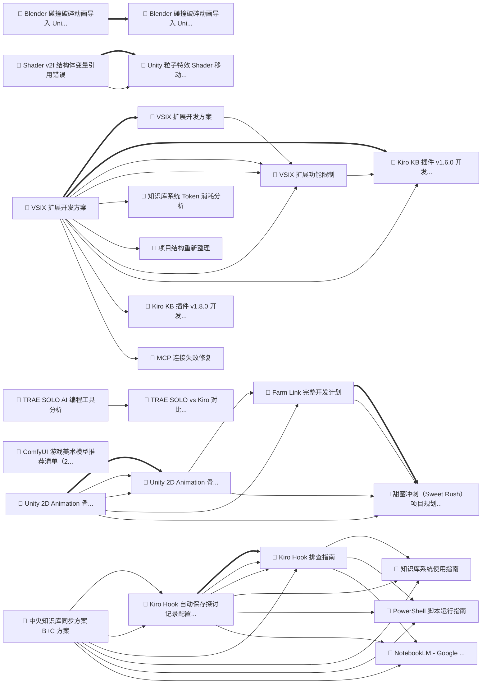

# 🕸️ 知识图谱分析报告

**构建时间**: 2026/1/4 16:05:26
**知识库路径**: d:\G_GitHub\Kiro-Central-KB

## 图谱统计

| 指标 | 数值 |
|------|------|
| 节点数 | 28 |
| 边数 | 86 |
| 平均度数 | 6.9 |

## 领域分布

| 领域 | 数量 | 占比 |
|------|------|------|
| other | 7 | 25.0% |
| kiro | 7 | 25.0% |
| tools | 5 | 17.9% |
| game-dev/unity | 3 | 10.7% |
| unity-graphics | 2 | 7.1% |
| game-dev | 1 | 3.6% |
| design-art/3d-modeling | 1 | 3.6% |
| ai-exploration/ai-art | 1 | 3.6% |
| tools/ai-assistant | 1 | 3.6% |

## 🌟 核心节点 (高连接度)

| 标题 | 领域 | 连接数 |
|------|------|------|
| VSIX 扩展开发方案 | kiro | 11 |
| VSIX 扩展功能限制 | kiro | 10 |
| Unity 2D Animation 骨骼动画使用教程 | game-dev | 10 |
| Unity 2D Animation 骨骼动画使用教程 | game-dev | 10 |
| Farm Link 完整开发计划 | game-dev | 10 |
| 甜蜜冲刺（Sweet Rush）项目规划 v2 | game-dev | 10 |
| Kiro Hook 自动保存探讨记录配置方案 | tools | 10 |
| Kiro Hook 排查指南 | tools | 10 |
| Kiro KB 插件 v1.6.0 开发记录 | kiro | 9 |
| 中央知识库同步方案 (B+C 方案) | tools | 9 |

## ⚠️ 孤立节点 (无关联)

以下知识条目与其他内容没有关联，建议补充标签或检查分类：

- 知识库整理任务 (other)
- 📥 新接收内容 (other)
- 2026-01-01-blender-collision-destruction (other)

## 📊 可视化图谱

> 提示：在支持 Mermaid 的编辑器中可以看到图谱可视化
