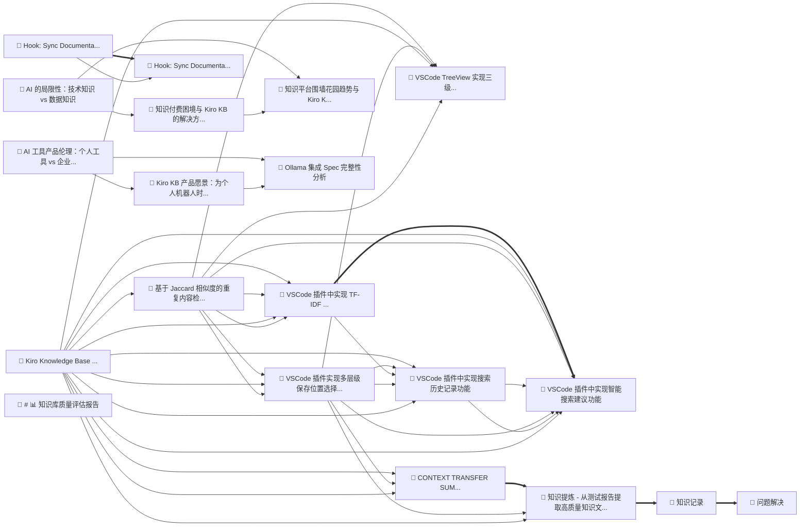

# 🕸️ 知识图谱分析报告

**构建时间**: 2026/1/9 11:14:30
**知识库路径**: d:\G_GitHub\Kiro-KB-Plugin\knowledge-base

## 图谱统计

| 指标 | 数值 |
|------|------|
| 节点数 | 20 |
| 边数 | 91 |
| 平均度数 | 9.6 |

## 领域分布

| 领域 | 数量 | 占比 |
|------|------|------|
| solution | 10 | 50.0% |
| product-strategy | 3 | 15.0% |
| discussion | 3 | 15.0% |
| note | 3 | 15.0% |
| other | 1 | 5.0% |

## 🌟 核心节点 (高连接度)

| 标题 | 领域 | 连接数 |
|------|------|------|
| VSCode 插件实现多层级保存位置选择器 | solution | 19 |
| VSCode TreeView 实现三级分组展示 | solution | 19 |
| VSCode 插件中实现搜索历史记录功能 | solution | 18 |
| VSCode 插件中实现智能搜索建议功能 | solution | 18 |
| Kiro Knowledge Base 插件开发指南 | solution | 16 |
| 基于 Jaccard 相似度的重复内容检测实现 | solution | 16 |
| CONTEXT TRANSFER SUMMARY | solution | 16 |
| VSCode 插件中实现 TF-IDF 语义搜索引擎 | solution | 15 |
| 知识提炼 - 从测试报告提取高质量知识文档 | solution | 13 |
| Kiro KB 产品愿景：为个人机器人时代做准备 | discussion | 5 |

## ⚠️ 孤立节点 (无关联)

以下知识条目与其他内容没有关联，建议补充标签或检查分类：

- # 📊 知识库质量评估报告 (other)

## 📊 可视化图谱

> 提示：在支持 Mermaid 的编辑器中可以看到图谱可视化
